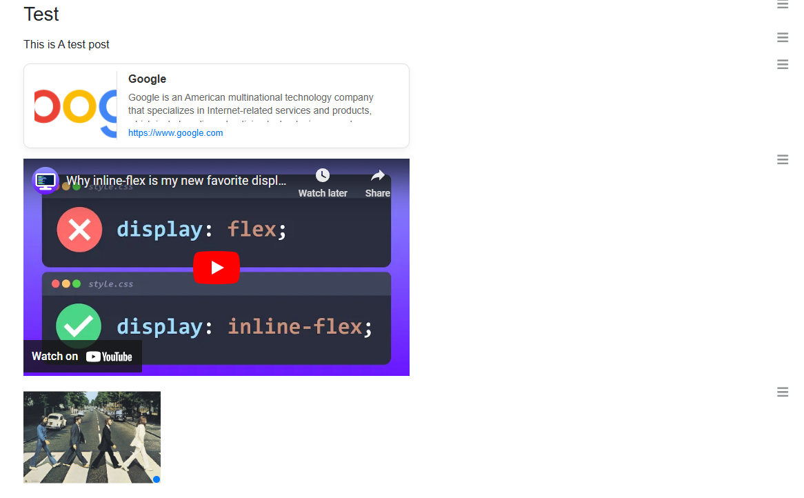
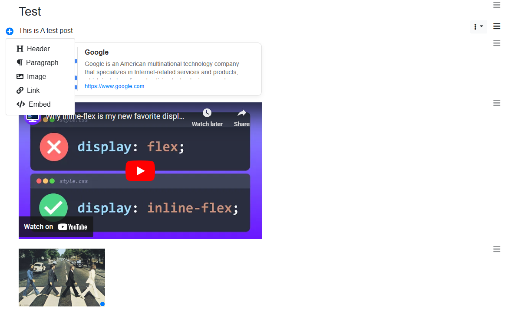
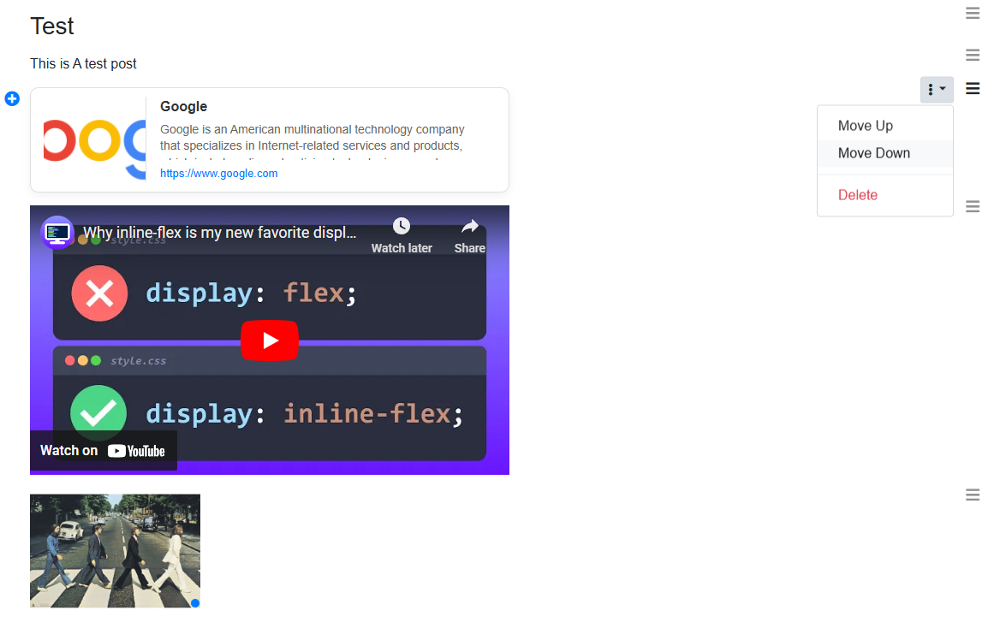

# WYSIWYG EZ Block Editor v0.2.0

### NOTE: Project is in **VERY EARLY STAGE** and still in development and may contain bugs or incomplete features.

## Description

A versatile and user-friendly WYSIWYG block editor that allows users to add and format blocks, including headers, paragraphs, images, links, and embedded content. 
The editor provides options for uploading images or linking from URLs, inserting media from embedded links, and applying text styling.

## Images

## Tech Stack

- **HTML/CSS**: Basic structure and styling
- **JavaScript (jQuery)**: Dynamic content manipulation and AJAX requests
- **Bootstrap**: Responsive UI components
- **SortableJS**: Drag-and-drop functionality
- **PHP**: Backend for image handling and URL parsing

## Features

- **Add Different Block Types**: Easily add headers, paragraphs, images, links, and embedded content.
- **Image Upload & URL Insertion**: Choose to upload an image or insert it via a URL.
- **Resizable Images**: Resize images by dragging the corner.
- **Responsive Link & Embed Blocks**: Preview links and embedded content dynamically based on Open Graph metadata.
- **Text Styling Options**: Apply bold, italic, underline, and strikethrough formatting.
- **Drag-and-Drop**: Organize blocks by dragging them to your desired order.

## ToDo
 - [ ] Add more block types
 - [ ] Clean up code and dependencies
 - [ ] Make modular and reusable components
 - [ ] Data output and saving
 - [ ] Handle url parsing and embeds (currently in test mode)
 - [ ] ...and many, many more things I can't think of right now

## Tested Browsers
- [x] Google Chrome
- [x] Microsoft Edge
